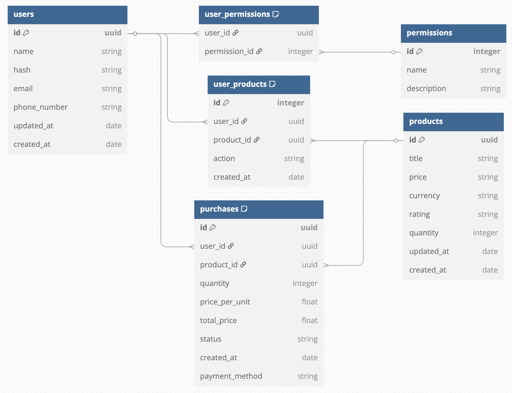

# Church Audio Gear Marketplace

_Full-stack e-commerce prototype for professional audio equipment_

## 📌 Project Overview

A complete implementation of an audio equipment marketplace with:

- Product catalog system
- User interaction flows
- Backend services architecture

## 🛠️ Technology Implementation

### Backend Services

| Component        | Technology        |
| ---------------- | ----------------- |
| API Framework    | Node.js + Express |
| Database ORM     | Knex.js           |
| Testing          | Jest + Supertest  |
| Containerization | Docker            |
| Banco de dados   | Postgres          |

### Frontend Implementation

| Component              | Technology   |
| ---------------------- | ------------ |
| Prototyping, Wireframe | Figma        |
| Framework              | Next.js      |
| Styling                | Tailwind CSS |

## 🚀 Technical Features

**Core Implementation**

- RESTful API service layer
- Database schema for product management
- Responsive UI components

**Development Focus**

- Clean architecture patterns
- Comprehensive test coverage
- CI/CD pipeline integration

## 🔧 Development Setup

```bash
# Initialize environment
git clone git@github.com:NotJotunnn/E-commerce-Project.git
npm install
docker-compose up -d  # Start container on:
                      # Database: 5432
npm run db:up         # Execute migrations
npm run db:seed       # Prepare the seed
npm run dev           # Start the node server
```

## Ports Utilized

| Service    | Port | Description                  |
| ---------- | ---- | ---------------------------- |
| API        | 8000 | Products endpoints           |
| PostgreSQL | 5432 | Database                     |
| Frontend   | 3000 | Next.js App (in development) |

### 📊 API routes

#### Main product routes:

- GET /produtos?limit=30&page=1 // List all products (paginated)
  // Default values:
  // - limit 30 (limits results per page, can go up to 80)
  // - page 1
- POST /produtos // Register new product
- GET /produtos/id/:id // Search product by id
- PUT /produtos/id/:id // Update product by id
- DELETE /produtos/id/:id // Remove product by id

##### _Necessary_ data for POST

- title // Product title // String (Cannot have duplicates)
- price // Product price // String (Cannot have symbols or letters like $ or R$)
- currency // Products currency // String (Accepts BRL - Brazilian real, USD - US Dollar, CAD - Canadian Dollar)
- rating // Products rating // String (Accepts 5.0/5)
- quantity // Products quantity // Number
- availability // Products availability // Boolean

#### Main user routes:

- GET /usuario // List all users
- POST /usuario // Register new user
- GET /usuario/id/:id // Search user by id
- PUT /usuario/id/:id // Update user by id
- DELETE /usuario/id/:id // Remove user by id

##### _Necessary_ data for POST

- name // User name // String
- hash // User password // String
- email // User email // String (Cannot have duplicates)
- phone_number // User phone number // String

#### Main permission routes:

- GET /permissao // List all permissions
- POST /permissao // Register new permission
- GET /permissao/id/:id // Search permission by id
- PUT /permissao/id/:id // Update permission by id
- DELETE /permissao/id/:id // Remove permission by id

##### _Necessary_ data for POST

- name // Permission name // String
- description // Permission desription // String

#### Main user_permission routes:

- GET /usuario-permissao // List all global users permissions
- POST /usuario-permissao // Register new permission for a user
- POST /usuario-permissao/batch // Register new permissions in batch for a user id
- GET /usuario-permissao/id/:id // Search permission by user id
- DELETE /usuario-permissao/user_id/:user_id/permission_id/:permission_id // Remove permission by user id

##### _Necessary_ data for POST

###### Base POST

- user_id // id from user // UUID
- permission_id // id from permission // UUID

###### Batch POST

- user_id // id from user // UUID
- permission_id[] // permission id Array // UUID

#### Main login routes

- POST /auth/login // returns jwt token

##### _Necessary_ data for POST

- email // email utilized on signup // String
- password // password used in signup // String

## 📊 Database Schema

<p style="display: flex; flex-direction: column; justify-content: center; align-items: center; width: 100%;">
  
  <p style="width: 500px; font-style: italic; opacity: 50%; justify-self: center;">Not completely implemented</p>
  <p style="width: 500px; font-style: italic; opacity: 50%; justify-self: center;">Diagram made in https://dbdiagram.io/d</p>
</p>

## 📝 Developer Note

This project demonstrates full-stack development capabilities I've acquired. While it simulates real-world e-commerce patterns, please note:

- It's an educational showcase, not a production system
- No payment systems are implemented
- I'm not expecting contributions as this is primarily evidence of my learning journey

## 📄 License

MIT

===== Português =====

# Marketplace de Equipamentos de Áudio para Igrejas

_Protótipo full-stack de e-commerce para equipamentos de áudio profissional_

## 📌 Visão Geral do Projeto

Implementação completa de um marketplace de equipamentos de áudio com:

- Sistema de catálogo de produtos
- Fluxos de interação do usuário
- Arquitetura de serviços backend

## 🛠️ Implementação Tecnológica

### Backend

| Componente      | Tecnologia        |
| --------------- | ----------------- |
| Framework API   | Node.js + Express |
| ORM de Banco    | Knex.js           |
| Testes          | Jest + Supertest  |
| Containerização | Docker            |
| Banco de dados  | Postgres          |

### Frontend

| Componente              | Tecnologia   |
| ----------------------- | ------------ |
| Prototipagem, Wireframe | Figma        |
| Framework               | Next.js      |
| Estilização             | Tailwind CSS |

## 🚀 Funcionalidades Técnicas

**Implementação Principal**

- Camada de serviço RESTful API
- Esquema de banco para gestão de produtos
- Componentes UI responsivos

**Foco de Desenvolvimento**

- Padrões de arquitetura limpa
- Cobertura abrangente de testes
- Integração de pipeline CI/CD

## 🔧 Configuração de Desenvolvimento

```bash
# Inicializar ambiente
git clone git@github.com:NotJotunnn/E-commerce-Project.git
npm install
docker-compose up -d  # Inicia containers nas portas:
                      # Banco: 5432
npm run db:up         # Executa migrações
npm run db:seed       # Prepara seed
npm run dev           # Inicia servidor Node
```

## Portas Utilizadas

| Serviço    | Porta | Descrição                              |
| ---------- | ----- | -------------------------------------- |
| API        | 8000  | Endpoints de produtos                  |
| PostgreSQL | 5432  | Banco de dados                         |
| Frontend   | 3000  | Aplicação Next.js (Em desenvolvimento) |

### 📊 Rotas da API

#### Rotas principais de produtos:

- GET /produtos?limit=30&page=1 // Lista todos os produtos (paginado)
  // Valores padrões:
  // - limit 30 (limita resultados por página, pode ir até 80)
  // - page 1
- POST /produtos // Cadastra novo produto
- GET /produtos/id/:id // Busca produto por id
- PUT /produtos/id/:id // Atualiza produto por id
- DELETE /produtos/id/:id // Remove produto por id

##### Dados _necessários_ para POST

- title // título do produto // String (Não pode haver duplicatas)
- price // preço do produto // String (Sem sinais ou letras como $, R$ ou equivalente)
- currency // moeda usada no produto // String (Aceita BRL - Brazilian real, USD - US Dollar, CAD - Canadian Dollar)
- rating // avaliação do produto // String (Aceita 5.0/5)
- quantity // quantidade do produto // Number
- availability // disponibilidade do produto // Boolean

#### Rotas principais de usuário:

- GET /usuario // Lista todos os usuários
- POST /usuario // Registra novo usuário
- GET /usuario/id/:id // Procura usuário por id
- PUT /usuario/id/:id // Atualiza usuário por id
- DELETE /usuario/id/:id // Deleta usuário por id

##### Dados _necessários_ para POST

- name // nome do usuário // String
- hash // senha do usuário // String
- email // email do usuário // String (Não pode haver duplicatas)
- phone_number // número do usuário // String

#### Rotas principais de permissões:

- GET /permissao // Lista todas as permissões
- POST /permissao // Registra nova permissão
- GET /permissao/id/:id // Procura permissão por id
- PUT /permissao/id/:id // Atualiza permissão por id
- DELETE /permissao/id/:id // Remove permissão por id

##### Dados _necessários_ para POST

- name // nome da permissão // String
- description // descrição da permissão // String

#### Rotas principais da relação usuário e permissões:

- GET /usuario-permissao // Lista todas as permissões de usuários globais
- POST /usuario-permissao // Registra nova permissão pro usuário
- POST /usuario-permissao/batch // Registra permissões em lote para um usuário
- GET /usuario-permissao/id/:id // Procura por permissões por id de usuário
- DELETE /usuario-permissao/user_id/:user_id/permission_id/:permission_id // Remove permissão por id de usuário

##### Dados _necessários_ para POST

###### POST base

- user_id // id do usuário // UUID
- permission_id // id da permissão // UUID

###### POST batch

- user_id // id do usuário // UUID
- permission_id[] // Array de ids de permissões // UUID

#### Rotas principais do login

- POST /auth/login // retorna um jwt relacionado ao usuário

##### Dados _necessários_ para POST

- email // email utilizado no cadastro // String
- password // senha usada no cadastro // String

## 📊 Diagrama

<p style="display: flex; flex-direction: column; justify-content: center; align-items: center; width: 100%;">
  
  <p style="width: 500px; font-style: italic; opacity: 50%; justify-self: center;">Não completamente implementado</p>
  <p style="width: 500px; font-style: italic; opacity: 50%; justify-self: center;">Diagrama feito em https://dbdiagram.io/d</p>
</p>

## 📝 Nota do Desenvolvedor

Este projeto demonstra capacidades full-stack que adquiri. Embora simule padrões de e-commerce reais, observe que:

- É um projeto educacional, não um sistema de produção
- Nenhum sistema de pagamentos está implementado
- Não aceito contribuições, pois serve principalmente como evidência da minha jornada de aprendizagem

## 📄 Licença

MIT
