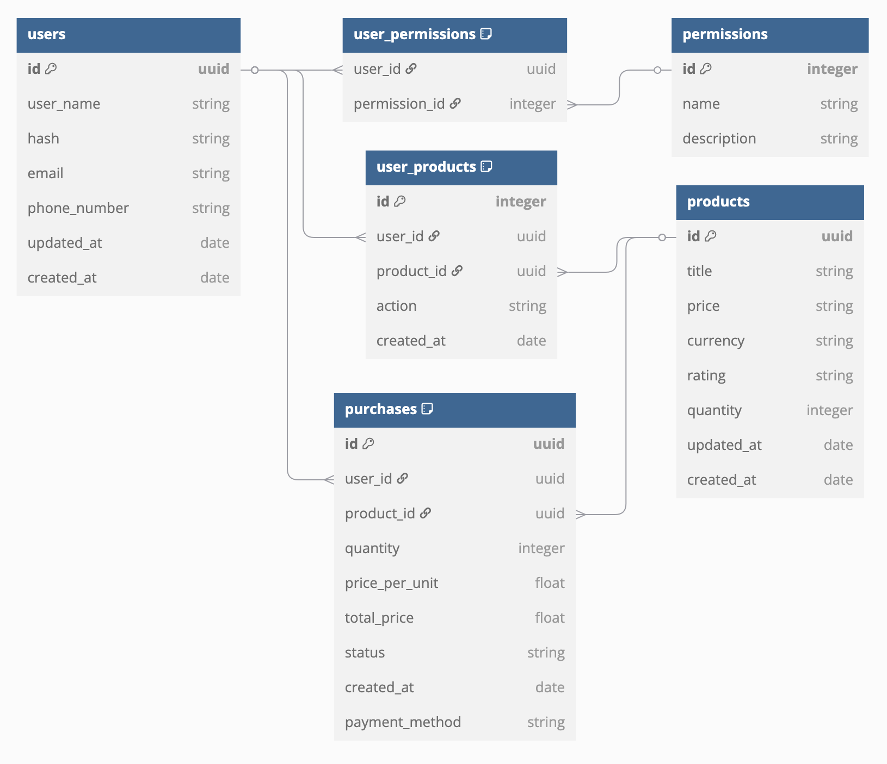

# Church Audio Gear Marketplace

_Full-stack e-commerce prototype for professional audio equipment_

## 📌 Project Overview

A complete implementation of an audio equipment marketplace with:

- Product catalog system
- User interaction flows
- Backend services architecture

## 🛠️ Technology Implementation

### Backend Services

| Component        | Technology        |
| ---------------- | ----------------- |
| API Framework    | Node.js + Express |
| Database ORM     | Knex.js           |
| Testing          | Jest + Supertest  |
| Containerization | Docker            |
| Banco de dados   | Postgres          |

### Frontend Implementation

| Component              | Technology   |
| ---------------------- | ------------ |
| Prototyping, Wireframe | Figma        |
| Framework              | Next.js      |
| Styling                | Tailwind CSS |

## 🚀 Technical Features

**Core Implementation**

- RESTful API service layer
- Database schema for product management
- Responsive UI components

**Development Focus**

- Clean architecture patterns
- Comprehensive test coverage
- CI/CD pipeline integration

## 🔧 Development Setup

```bash
# Inicializar ambiente
git clone [url-do-repositório]
npm install
docker-compose up -d  # Start container on:
                      # Database: 5432
npm run db:up         # Execute migrations
npm run db:seed       # Prepare the seed
npm run dev           # Start the node server
```

## Ports Utilized

| Service    | Port | Description                  |
| ---------- | ---- | ---------------------------- |
| API        | 8000 | Products endpoints           |
| PostgreSQL | 5432 | Database                     |
| Frontend   | 3000 | Next.js App (in development) |

### 📊 API routes

#### Main product routes:

- GET /produtos // List all products
- POST /produtos // Register new product
- GET /produtos/id/:id // Search by Id
- PUT /produtos/id/:id // Update by ID
- DELETE /produtos/id/:id // Remove by ID

## 📊 Database Schema

<p style="display: flex; flex-direction: column; justify-content: center; align-items: center; width: 100%;">
  
  <p style="width: 500px; font-style: italic; opacity: 50%; justify-self: center;">Not completely implemented</p>
</p>

## 📝 Developer Note

This project demonstrates full-stack development capabilities I've acquired. While it simulates real-world e-commerce patterns, please note:

- It's an educational showcase, not a production system
- No payment systems are implemented
- I'm not expecting contributions as this is primarily evidence of my learning journey

## 📄 License

MIT

===== Português =====

# Marketplace de Equipamentos de Áudio para Igrejas

_Protótipo full-stack de e-commerce para equipamentos de áudio profissional_

## 📌 Visão Geral do Projeto

Implementação completa de um marketplace de equipamentos de áudio com:

- Sistema de catálogo de produtos
- Fluxos de interação do usuário
- Arquitetura de serviços backend

## 🛠️ Implementação Tecnológica

### Backend

| Componente      | Tecnologia        |
| --------------- | ----------------- |
| Framework API   | Node.js + Express |
| ORM de Banco    | Knex.js           |
| Testes          | Jest + Supertest  |
| Containerização | Docker            |
| Banco de dados  | Postgres          |

### Frontend

| Componente              | Tecnologia   |
| ----------------------- | ------------ |
| Prototipagem, Wireframe | Figma        |
| Framework               | Next.js      |
| Estilização             | Tailwind CSS |

## 🚀 Funcionalidades Técnicas

**Implementação Principal**

- Camada de serviço RESTful API
- Esquema de banco para gestão de produtos
- Componentes UI responsivos

**Foco de Desenvolvimento**

- Padrões de arquitetura limpa
- Cobertura abrangente de testes
- Integração de pipeline CI/CD

## 🔧 Configuração de Desenvolvimento

```bash
# Inicializar ambiente
git clone [url-do-repositório]
npm install
docker-compose up -d  # Inicia containers nas portas:
                      # Banco: 5432
npm run db:up         # Executa migrações
npm run db:seed       # Prepara seed
npm run dev           # Inicia servidor Node
```

## Portas Utilizadas

| Serviço    | Porta | Descrição                              |
| ---------- | ----- | -------------------------------------- |
| API        | 8000  | Endpoints de produtos                  |
| PostgreSQL | 5432  | Banco de dados                         |
| Frontend   | 3000  | Aplicação Next.js (Em desenvolvimento) |

### 📊 Rotas da API

#### Rotas principais de produtos:

- GET /produtos // Lista todos
- POST /produtos // Cadastra novo
- GET /produtos/id/:id // Busca por ID
- PUT /produtos/id/:id // Atualiza por ID
- DELETE /produtos/id/:id // Remove por ID

## 📊 Diagrama

<p style="display: flex; flex-direction: column; justify-content: center; align-items: center; width: 100%;">
  
  <p style="width: 500px; font-style: italic; opacity: 50%; justify-self: center;">Não completamente implementado</p>
</p>

## 📝 Nota do Desenvolvedor

Este projeto demonstra capacidades full-stack que adquiri. Embora simule padrões de e-commerce reais, observe que:

- É um projeto educacional, não um sistema de produção
- Nenhum sistema de pagamentos está implementado
- Não aceito contribuições, pois serve principalmente como evidência da minha jornada de aprendizagem

## 📄 Licença

MIT
